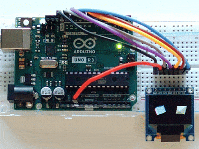

# IntegerWorld

## Integer‑only 3D rendering engine for microcontrollers.

- **Scene‑based 3D rendering**
- **Triangle mesh rasterization**
- **Per‑fragment lighting**
- **Material‑driven shading**
- **Depth‑sorted rendering**
- **Platform‑agnostic output**
- **Arduino compatible**
- **Integer-only math for fast rendering with low memory use**
---

## Christmas Tree Scene🎄

**RP2350 (Raspberry Pi Pico 2)**  
- Resolution: **172×320**
- Clock: **150 MHz**
- Performance: **~20 FPS**

This scene is the **design target** for IntegerWorld:
- triangle meshes, point clouds
- material‑based shading
- multiple light sources
- custom shaders
- objects imported from BlockMesh project

---

## Scaling Down: Tiny Scene Demo on AVR

**ATmega328 (Arduino AVR)**  
- Resolution: **96×64**
- Clock: **16 MHz**
- Performance: **~33 FPS**

Same pipeline, same math model — scaled to 8‑bit hardware

---

## Dependencies

- [TaskScheduler](https://github.com/arkhipenko/TaskScheduler)
- [IntegerSignal](https://github.com/GitMoDu/IntegerSignal)
